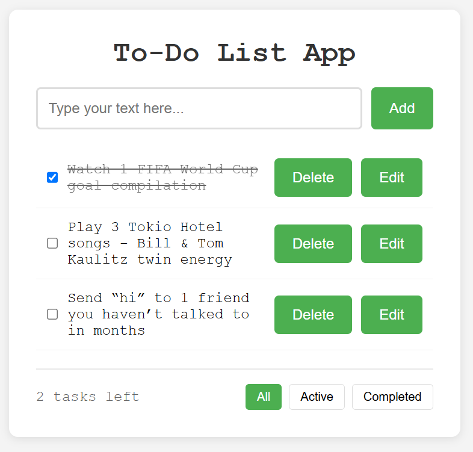

# Vanilla JS Todo App

A simple task manager built with HTML, CSS, and vanilla JavaScript. Add, delete, and filter tasks.

## Features
- Add/delete tasks
- Mark tasks complete with strikethrough  
- Filter: All, Active, Completed
- Responsive layout
- 
## Screenshot

## How to Run
1. Clone this repo
2. Open `index.html` in your browser

## Project Structure
vanilla-js-todo-app/
├── index.html
├── style.css
├── script.js
├── screenshot.png
└── README.md

## What I Learned
DOM manipulation, event delegation, CSS Flexbox, and input validation with `trim()`.
